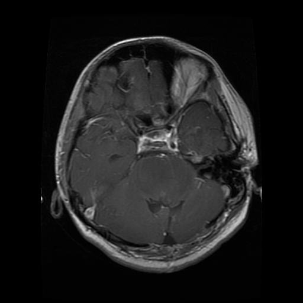
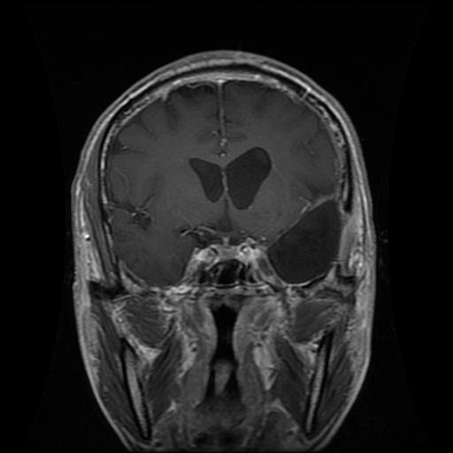
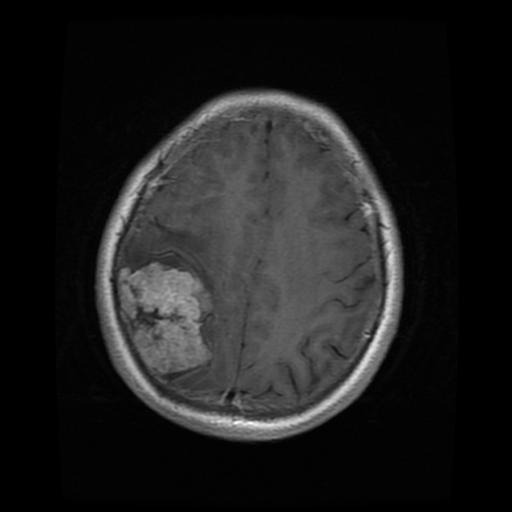
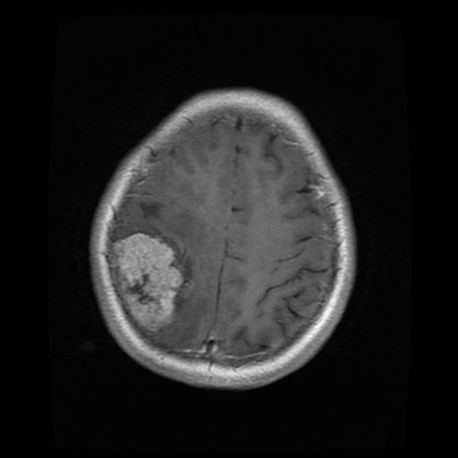
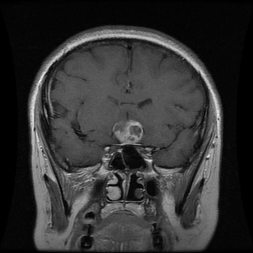
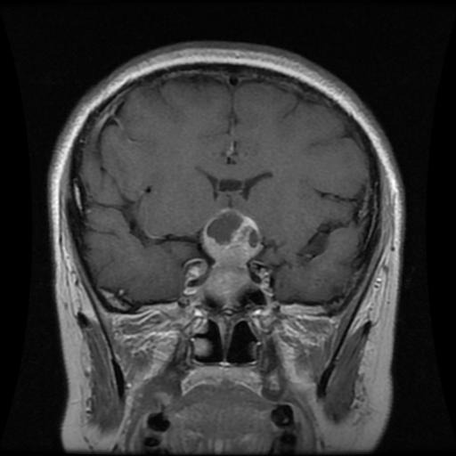
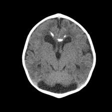
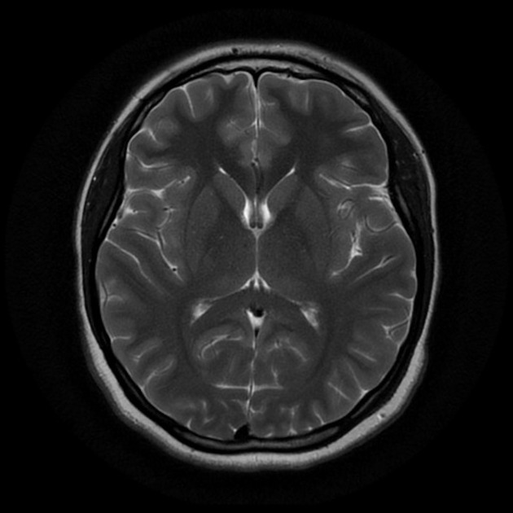

# 🧠 TumorVision – Brain Tumor Classification using Deep Learning (CNN)


## 📌 Project Overview

**TumorVision** is a deep learning project that classifies brain MRI scans into two categories:  
- **Tumor Present**  
- **No Tumor**  

It uses a Convolutional Neural Network (CNN) for automated brain tumor detection, aiming to assist doctors and radiologists with faster and more accurate diagnoses.

---
## Model Live Working
You can now view your tumor class
  Network URL: http://172.23.8.91:8501
---

## 🧪 Tech Stack

- 🐍 Python 3.x  
- 📊 NumPy, Pandas, Matplotlib  
- 🧠 Pytorch , ResNet50 
- 🖼 OpenCV / Pillow  
- 📝 Jupyter Notebook  

---

## 🧬 Dataset

The dataset consists of **MRI brain images**, organized into two folders:  
- `yes` → Tumor present  
- `no` → Tumor not present  

All images are preprocessed (resized & normalized) before being used for training.

---

## 🚀 Features

- ✅ Image preprocessing (resizing, normalization)  
- ✅ Binary classification with CNN  
- ✅ Accuracy & loss visualization during training  
- ✅ Sample predictions on test images with visual results  

---

## 📂 Folder Structure

```bash
📁 TumorVision/
├── tumorvision.ipynb
├── README.md
└── 📁 data/
    ├── yes/
    └── no/
```

---

## How to Run
Clone the repo
```
git clone https://github.com/surendrak21/TumorVision.git
cd TumorVision
```
Navigate to project directory
 ``` cd brain_tumor_detection ```
 Install dependencies
 ``` pip install -r requirements.txt ``` 


---

## 📸 Tumor Classes 


### 📝 glioma



### 🔐 meningioma




### 📚 pituitary



### 🗓️ notumor



---


 💡 Future Improvements
Add multiclass classification for tumor types

Use transfer learning (e.g., VGG16, ResNet50)

Integrate Flask app for real-time prediction

🤝 Contributing
Pull requests are welcome! For major changes, please open an issue first to discuss what you would like to change.
---